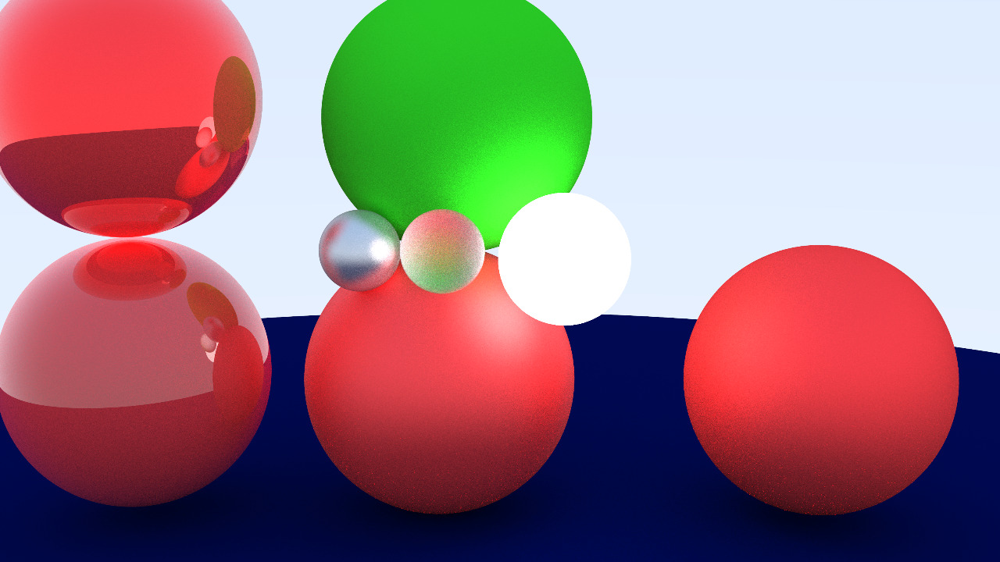
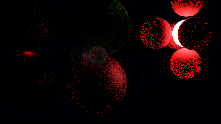

# Ray Tracer <!-- omit in toc -->

A Ray Tracer made by Isard Botha for fun.

- [Images](#images)
  - [Starting point](#starting-point)
  - [Full BSDF](#full-bsdf)
  - [Basic Algorithm Small Light Source](#basic-algorithm-small-light-source)
- [Initial Path-Tracing Algorithm](#initial-path-tracing-algorithm)
- [Material](#material)
- [Resources](#resources)

## Images

### Starting point

### Full BSDF

### Basic Algorithm Small Light Source

## Initial Path-Tracing Algorithm

The starting algorithm here leans heavily on monte-carlo integration. In essense we cast a large amount of rays which all scatter based on probabilities defined by the material. As more samples are taken we converge on the true look of the image.

The image rendered this way only converges quickly if there is a high chance of hitting the light source (The sky in this case). If there is a smaller light source the image remains very noisy.

## Material

This ray-tracer utilizes a universal material that considers the following properties.

Colours
* diffuse
*	emission
*	specular
*	reflective
*	ambient
*	transparent

Scalars
*	shininess
*	shininess_strength
*	shininess_tint
*	reflectivity
*	refraction_index
*	transmission

The material amounts to a scatter function which takes an incoming ray, and information about the collision. It returns an attenuation (how the incoming light is absorbed) and a scattered ray.

## Resources

[Ray Tracing In One Weekend](https://raytracing.github.io/)